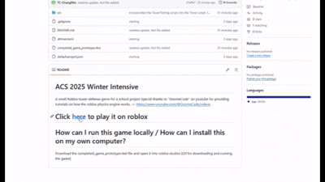
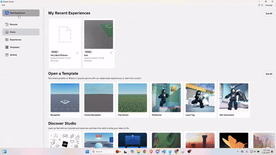

# ACS 2025 Winter Intensive 
A small Roblox tower defense game for a school project
Special thanks to "GnomeCode" on youtube for providing tutorials on how the roblox physics engine works.
-> https://www.youtube.com/@GnomeCode/videos

# Click [here](https://www.roblox.com/games/114457019372545/Very-Bad-TD-Game#!/about) to play it on roblox

# How can I run this game locally / How can I install this on my own computer?
Download the completed_game_prototype.rbxl file and open it into roblox studios

# Controls
* WASD to move
* Right Click hold to move camera
* Left click to select
* R to rotate a selected tower